# Автоворонка продаж: WhatsApp (Evolution API) → n8n → AlfaCRM + LLM

[](https://github.com/klimichtg/n8n-whatsapp-alfacrm-funnel/actions/workflows/validate.yml)


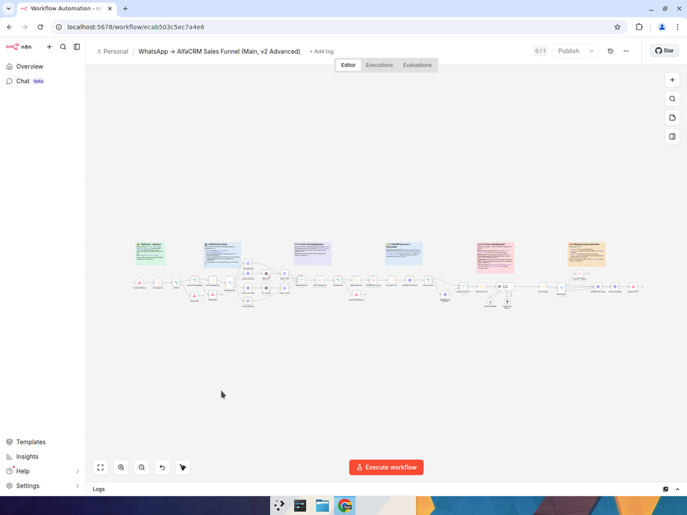

Production-ready заготовка автоматической воронки продаж для AlfaCRM. **Не туториал из n8n templates.** Решены реальные production-проблемы, с которыми сталкиваются интеграции WhatsApp + AI + CRM в боевой работе.

Стек ровно тот, что в ТЗ:

- **n8n** — оркестратор (queue mode + Postgres + Redis для durable execution под нагрузкой)
- **Evolution API v2** — WhatsApp-шлюз (self-hosted)
- **AlfaCRM REST API v2** — CRM (создание контактов, сделок, перевод по этапам воронки)
- **LLM** — OpenAI / Gemini / Anthropic (одна нода, swap без касания остальной логики)

---

## Что выделяет эту реализацию

| Что почти у всех | Что есть здесь |
| --- | --- |
| Один большой workflow с inline auth на каждом шаге | **5 переиспользуемых sub-workflow** (`Execute Workflow` композиция) |
| AlfaCRM auth на каждое сообщение (5 req/sec лимит горит) | **Token caching в Redis** (1 токен → ~17 280 запросов/час) |
| Один ответ на каждое входящее → бот выглядит как робот | **Human-like message buffering** (Redis-debounce 6с, склейка в один контекст) |
| Только текст | **Multimodal**: audio → Whisper STT, image → GPT-4o vision |
| Падение → тишина | **Error Trigger workflow** → алерты в Telegram |
| Горячий лид ждёт пока менеджер откроет CRM | **Hot-lead handoff в Telegram-канал отдела продаж** с inline-кнопкой и deep-link |
| HTTP Request узлы с захардкоженными хедерами | **Custom community node** `n8n-nodes-alfacrm` (TypeScript) с retry / cache / rate limit |
| HTTP без HTTPS, ручная настройка nginx | **Caddyfile** для one-command HTTPS через Let's Encrypt |
| Webhook принимает что угодно от кого угодно | **Signature validation** (apikey + опциональный HMAC-SHA256) |
| «Работает у меня на ноуте» | **Health-check workflow** (cron 5 мин → ping всех 3 сервисов → алерт) |

---

## Архитектура

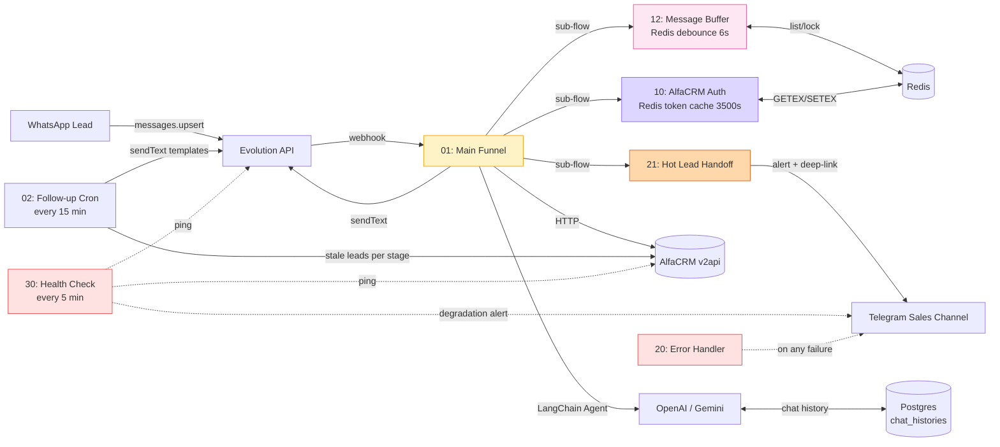

### Sequence: входящее сообщение

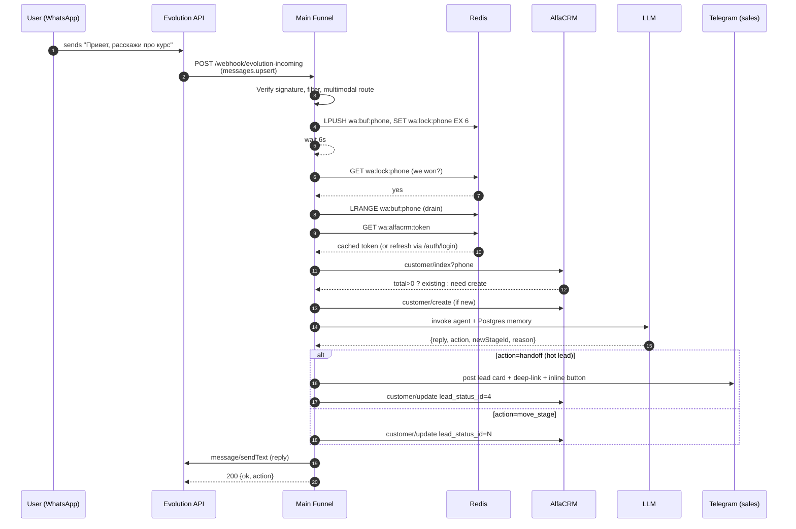

---

## Скриншоты

### Список workflow в n8n
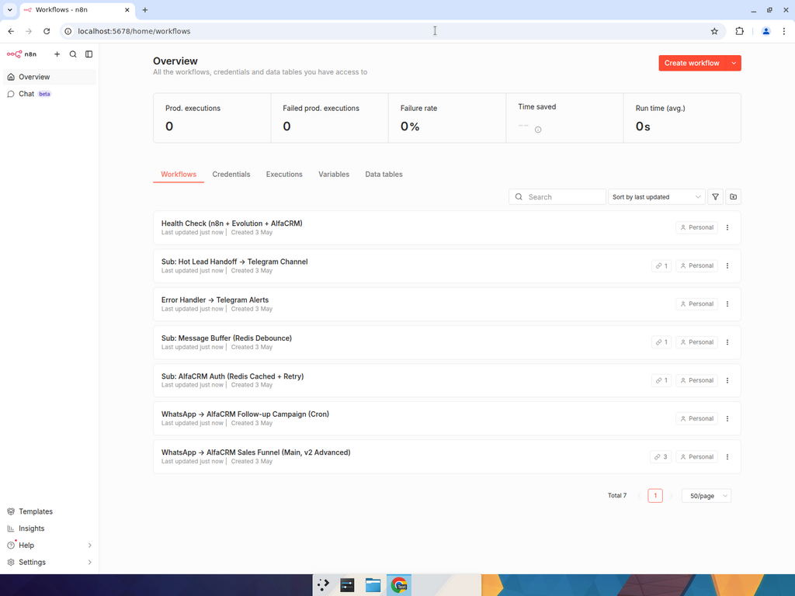

### Main funnel (v2 advanced) — общий вид


### Main funnel — секция 1: Webhook + signature + multimodal routing
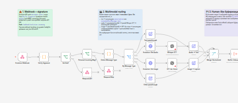

### Main funnel — секция 2: Buffer (Redis debounce) + AlfaCRM (find/create через cached auth)
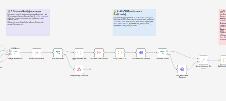

### Main funnel — секция 3: AI agent + Postgres memory + Routing → Telegram handoff
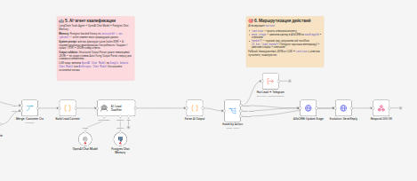

### Sub-workflow: Message Buffer (Redis debounce)
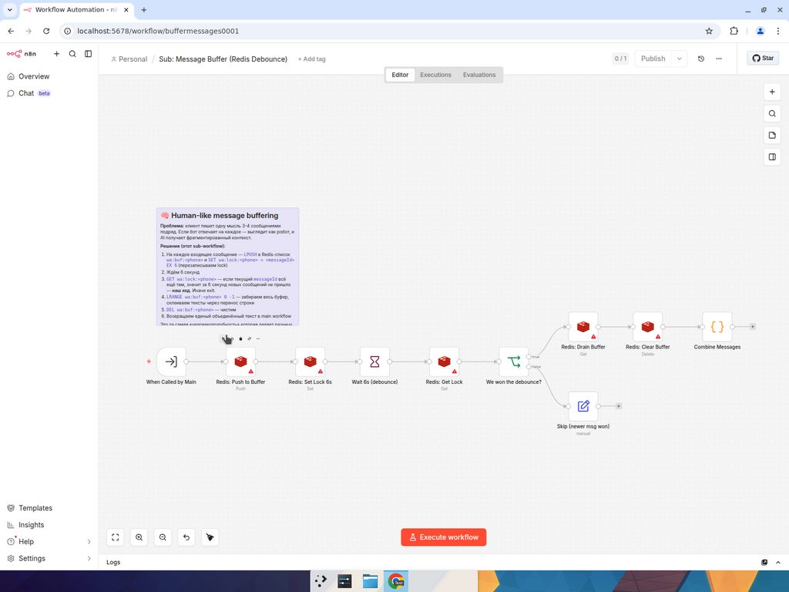

### Sub-workflow: AlfaCRM Auth с Redis-кэшем
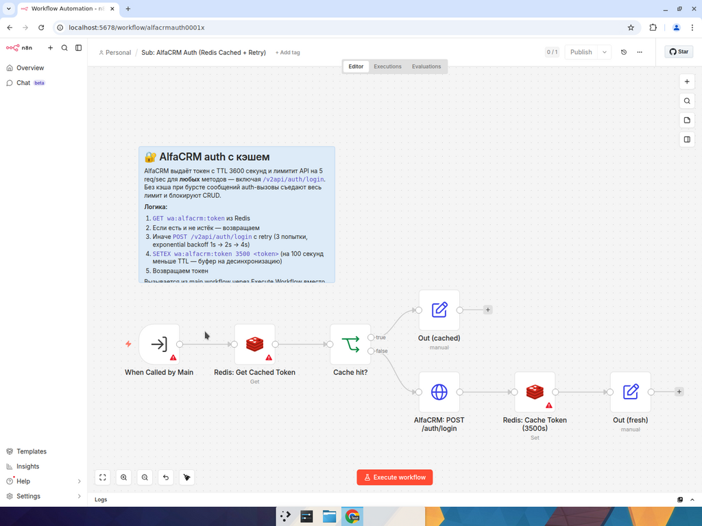

### Sub-workflow: Hot Lead Handoff в Telegram отдела продаж
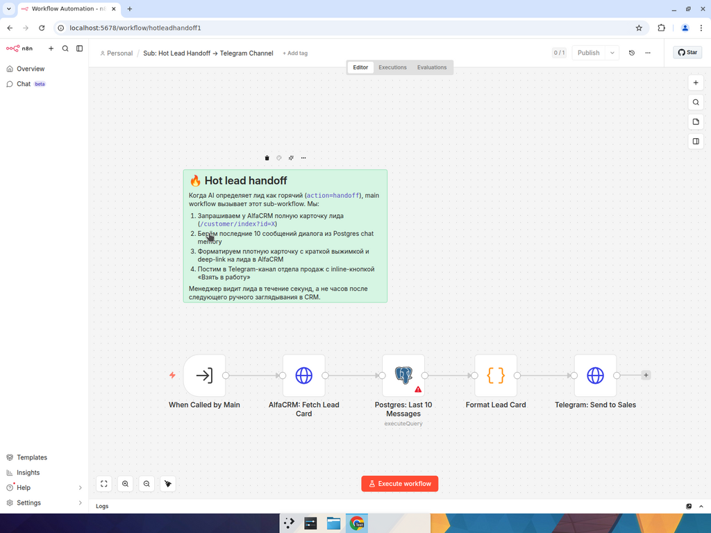

### Health Check workflow (cron 5 мин → пинг всех сервисов)
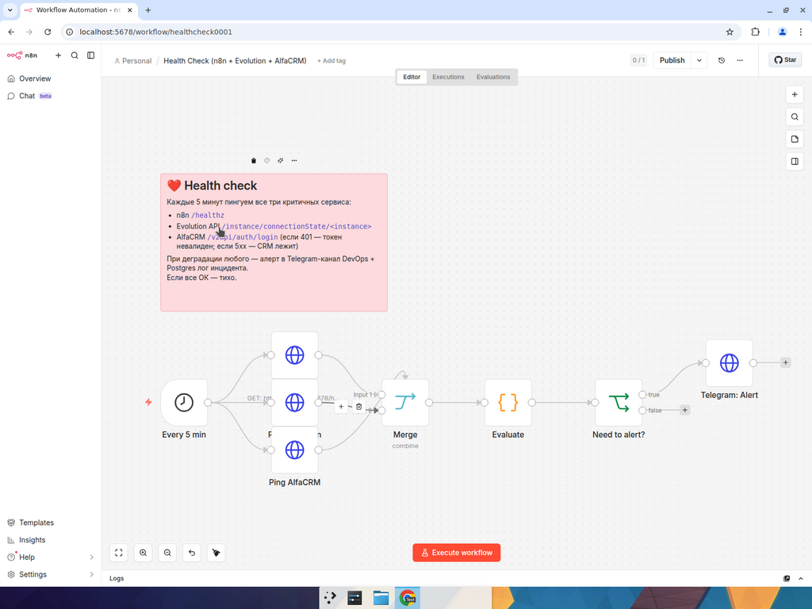

### Cron follow-up campaign
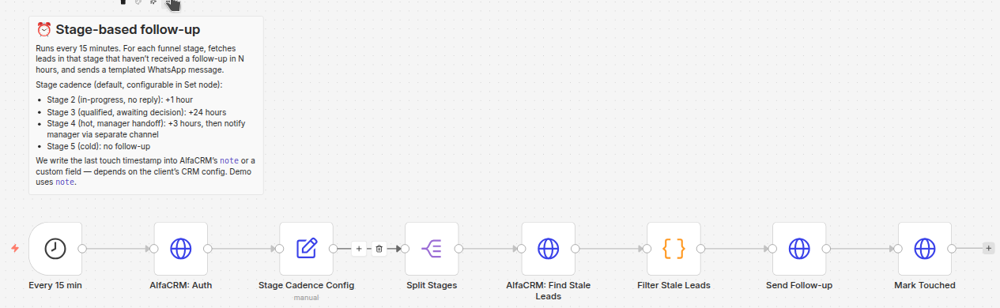

### Доказательство работы webhook (зелёные галки на trigger + filter + normalize)
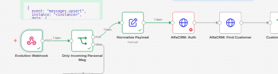

---

## Структура репо

```
.
├── docker-compose.yml              # n8n (main+worker) + Postgres + Redis + Evolution API
├── Caddyfile                       # production reverse proxy + Let's Encrypt
├── .env.example                    # все переменные окружения
├── .github/workflows/validate.yml  # CI: JSON-валидация, shellcheck, TS-чек
│
├── workflows/                      # 7 workflows (90 узлов суммарно)
│   ├── 01_main_funnel.json         # main, v2 advanced (multimodal + buffer + sub-workflows)
│   ├── 02_followup_cron.json       # cron follow-up по этапам воронки
│   ├── 10_alfacrm_auth_cached.json # sub: AlfaCRM auth с Redis-кэшем + retry
│   ├── 12_buffer_messages.json     # sub: human-like message debounce (Redis lock)
│   ├── 20_error_handler.json       # Error Trigger → Telegram алерты
│   ├── 21_hot_lead_handoff.json    # sub: hot-lead карточка в Telegram-канал
│   └── 30_healthcheck.json         # cron 5min → ping n8n + Evolution + AlfaCRM
│
├── packages/n8n-nodes-alfacrm/     # custom n8n community node (TypeScript)
│   ├── credentials/AlfaCrmApi.credentials.ts
│   ├── nodes/AlfaCRM/AlfaCRM.node.ts
│   ├── package.json
│   └── tsconfig.json
│
├── examples/
│   ├── evolution_messages_upsert.json   # реальный payload Evolution для теста
│   ├── alfacrm_create_customer.json     # тело и ответ AlfaCRM customer/create
│   ├── alfacrm_auth.sh                  # curl для получения токена AlfaCRM
│   ├── test_webhook.sh                  # smoke-тест воронки локально
│   └── test_scenarios.sh                # 5 готовых сценариев end-to-end
│
└── docs/
    └── screenshots/                # скриншоты workflow в n8n
```

---

## Быстрый запуск

```bash
git clone https://github.com/klimichtg/n8n-whatsapp-alfacrm-funnel.git
cd n8n-whatsapp-alfacrm-funnel

cp .env.example .env
# заполняем секреты (см. ниже)
nano .env

docker compose up -d

# импортируем все 7 workflow одной командой
for f in workflows/*.json; do
  docker compose exec -T n8n-main n8n import:workflow --input="/workflows/$(basename $f)"
done

open http://localhost:5678
```

### Минимум переменных для запуска

| Переменная | Где взять |
| --- | --- |
| `N8N_ENCRYPTION_KEY` | `openssl rand -hex 32` |
| `POSTGRES_PASSWORD` | любое сильное значение |
| `EVOLUTION_API_KEY` | произвольный токен; задаётся при первом запуске |
| `EVOLUTION_HMAC_KEY` | (опц.) HMAC-SHA256 для усиленной валидации webhook |
| `ALFACRM_HOSTNAME` | hostname кабинета AlfaCRM, например `demo.s20.online` |
| `ALFACRM_EMAIL` / `ALFACRM_API_KEY` | Профиль → «E-mail» и «Ключ API (v2api)» |
| `ALFACRM_BRANCH_ID` | ID активного филиала |
| `ALFACRM_DEFAULT_LEAD_STATUS_ID` | ID первичного этапа («Новый лид») |
| `ALFACRM_WHATSAPP_LEAD_SOURCE_ID` | ID источника «WhatsApp» |
| `OPENAI_API_KEY` или `GEMINI_API_KEY` | соответствующий провайдер |
| `TELEGRAM_BOT_TOKEN` | для алертов и handoff (BotFather) |
| `TELEGRAM_SALES_CHAT_ID` | ID канала отдела продаж |
| `TELEGRAM_ALERT_CHAT_ID` | ID канала DevOps/алертов |

### Подключение WhatsApp-инстанса в Evolution API

```bash
# создаём инстанс
curl -X POST http://localhost:8080/instance/create \
  -H "apikey: $EVOLUTION_API_KEY" -H 'Content-Type: application/json' \
  -d '{
    "instanceName": "sales-bot-1",
    "qrcode": true,
    "webhook": {
      "enabled": true,
      "url": "http://n8n-main:5678/webhook/evolution-incoming",
      "events": ["MESSAGES_UPSERT", "CONNECTION_UPDATE"],
      "headers": { "apikey": "<EVOLUTION_API_KEY>" }
    }
  }'

# забираем QR-код (base64) и сканируем в WhatsApp на телефоне
curl -H "apikey: $EVOLUTION_API_KEY" \
  http://localhost:8080/instance/connect/sales-bot-1
```

### Запуск тестовых сценариев

```bash
WEBHOOK_URL=http://localhost:5678/webhook/evolution-incoming \
  ./examples/test_scenarios.sh
```

5 сценариев: новый лид, повторное обращение, горячий лид (handoff), не целевой лид, групповой чат (фильтр).

---

## Адаптация под клиента

Под конкретный кабинет AlfaCRM **обязательно** правится:

1. **`lead_status_id`** в системном промпте AI-агента — маппинг этапов воронки (Настройки → Продажи → Этапы воронки).
2. **`lead_source_id`** — ID источника «WhatsApp» (Настройки → Продажи → Источники лидов).
3. **Системный промпт** AI-агента — он сейчас написан под образовательный B2C; для других ниш переписывается за 15 минут.
4. **Каденция follow-up** — `Stage Cadence Config` в `02_followup_cron.json` (часы между касаниями для каждого этапа).
5. **Шаблоны follow-up сообщений** — там же, поддерживают `{{name}}`.
6. **Telegram chat IDs** — каналы для hot-lead handoff и алертов.

---

## Production-чеклист

| Что | Где реализовано |
| --- | --- |
| Postgres + Redis durable execution + queue mode | `docker-compose.yml` |
| n8n-worker для горизонтального масштабирования | `docker-compose.yml` |
| Reverse proxy + Let's Encrypt HTTPS | `Caddyfile` |
| Кэш токена AlfaCRM в Redis (TTL 3500с) | `workflows/10_alfacrm_auth_cached.json` |
| Валидация подписи webhook (apikey + HMAC) | `workflows/01_main_funnel.json` (Verify Signature node) |
| Rate limit + retry на ноды AlfaCRM | `Retry On Fail` в HTTP Request + custom node `n8n-nodes-alfacrm` (5 req/sec token bucket) |
| Дедупликация входящих по `data.key.id` | покрывается buffer'ом (idempotent через `messageId` lock) |
| Алерты при падениях | `workflows/20_error_handler.json` (Telegram) |
| Health check всех сервисов | `workflows/30_healthcheck.json` (cron 5min) |
| Hot-lead → менеджер | `workflows/21_hot_lead_handoff.json` (Telegram inline-кнопка) |
| Бэкапы Postgres | TODO: cron `pg_dump` каждые 6 часов |
| Метрики n8n | TODO: Prometheus endpoint + Grafana dashboard |

---

## Custom n8n Node `n8n-nodes-alfacrm`

В `packages/n8n-nodes-alfacrm/` лежит community node для AlfaCRM REST API v2 (TypeScript). Заменяет HTTP Request узлы на типизированный AlfaCRM-узел с:

- Token caching в памяти процесса (1h TTL — 100s safety buffer)
- Auto re-login на 401 + retry once
- Exponential backoff на 5xx (3 попытки: 1s → 2s → 4s)
- Local rate limiter (5 req/sec, token bucket)
- Resources: `customer`, `lesson`, `branch`, `lead-source`
- Operations: `list`, `get`, `create`, `update`, `delete`

Подробнее — `packages/n8n-nodes-alfacrm/README.md`.

---

## Ответы на частые вопросы (которые задаст клиент)

**Q: Как держится контекст диалога между сообщениями?**
A: `Postgres Chat Memory` (LangChain) с `sessionId = wa:<phoneE164>`. История подгружается в каждый запрос к LLM, окно 20 сообщений. Замена на Redis Memory — одна нода. Postgres-таблица: `n8n_chat_histories`.

**Q: А что если клиент пишет 3 сообщения подряд за 5 секунд? Бот ответит 3 раза?**
A: Нет. Sub-workflow `12_buffer_messages` дебаунсит входящие через Redis-lock + LPUSH в буфер. Через 6 секунд после последнего сообщения «победитель» (последний messageId, чей lock не перезаписали) забирает все сообщения из буфера, склеивает их в один контекст и идёт дальше. Остальные параллельные ветки exit'ят без ответа.

**Q: Что если LLM вернёт мусор вместо JSON?**
A: Узел `Parse AI Output` сначала пытается `JSON.parse(content)`, при ошибке — `JSON.parse(content.match(/\{[\s\S]*\}/)[0])` (extract first JSON object). Если и это не парсится — fallback с `action=continue` и нейтральным reply. На проде сверху ставится `Auto-fixing Output Parser` (LangChain), который переспрашивает LLM при невалидном JSON.

**Q: Как валидируется webhook от Evolution API?**
A: Узел `Verify Signature` проверяет header `apikey === $env.EVOLUTION_API_KEY` (всегда) и опционально HMAC-SHA256 над телом запроса (если выставлен `EVOLUTION_HMAC_KEY`). Невалидные запросы → 401. На уровне Caddyfile дополнительно rate-limit 60 req/min/IP.

**Q: Что с rate limit AlfaCRM (5 req/sec)?**
A: Три уровня защиты: (1) кэш токена в Redis экономит ~50% запросов (auth не дёргается каждый раз), (2) HTTP Request `Retry On Fail` с exponential backoff на 429/5xx, (3) custom community node содержит in-process token bucket 5 req/sec — даже при бурсте запросов node сам пейсит вызовы.

**Q: Почему 7 воркфлоу, а не один большой?**
A: Декомпозиция по domain + lifecycle: реактивная воронка / cron follow-up / health check имеют разные SLA и failure modes. Sub-workflow (auth, buffer, handoff) переиспользуются и тестируются изолированно. Падение cron не блокирует живые диалоги, и наоборот.

**Q: Как переключить OpenAI ↔ Gemini ↔ Claude?**
A: Один узел: заменить `OpenAI Chat Model` на `Google Gemini Chat Model` или `Anthropic Chat Model` (все встроенные в LangChain ноды n8n) и пересоединить `ai_languageModel` порт к AI Agent. Системный промпт, парсер, маршрутизация — не меняются.

**Q: Что с голосовыми и фотографиями от клиента?**
A: Multimodal handling в `01_main_funnel.json`: `By Message Type` switch разводит по типам. Audio → Evolution `getBase64FromMediaMessage` → OpenAI Whisper STT (`language=ru`) → используем транскрипт как text. Image → OpenAI GPT-4o vision с промптом «опиши + извлеки текст» → caption кладётся как text для AI-агента.

**Q: Что происходит если AlfaCRM лежит?**
A: Health check workflow обнаруживает деградацию в течение 5 минут и постит алерт в Telegram. Сам main funnel: Retry On Fail (3 попытки), затем 502 в респонсе webhook. Postgres-память сохраняется — клиент при возврате CRM получит ответ от LLM на основе истории, мы пометим лид флагом «отложенная синхронизация» и проставим стадию post-factum.

**Q: Как масштабироваться?**
A: n8n queue mode уже настроен — поднимаем `n8n-worker` (concurrency 10 на инстанс). При >100 сообщений/секунду рассыпать main funnel на shards по hash(phone) — Redis-стрим ➝ N shards ➝ N main funnels.

**Q: Кто хранит историю диалога — n8n или AlfaCRM?**
A: Обе. Postgres `n8n_chat_histories` — для LLM (хранит структурированные human/ai сообщения LangChain). AlfaCRM `note` — для менеджера (краткие пометки «AI move: причина»). При hot-lead handoff в Telegram-карточку подтягиваются последние 10 сообщений из Postgres, чтобы менеджер видел контекст.

---

## Лицензия

MIT — на код заготовки. Воркфлоу JSON свободно адаптируйте под свои проекты.
